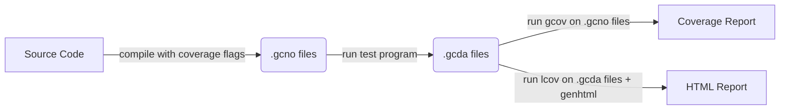

# Code coverage with `gcov`, `lcov` and `genhtml`

`gcov` is a code coverage tool that comes with the GNU Compiler Collection (GCC). It analyzes the code coverage of C, C++, and other language programs by providing line-by-line execution counts, helping developers understand which parts of the code are being tested and which are not.

`lcov` is a graphical front-end for gcov that makes it easier to visualize code coverage. It collects coverage data from gcov and generates HTML reports, making it simpler to view the code coverage results in a web browser.

`genhtml` is a tool used with lcov to convert coverage data into HTML reports, making it easy to view and navigate the coverage results in a web browser.

## Flow

1. Enable coverage flags to instrument code.
2. Run test program (or programs) to generate `.gcda` files.
3. Run `gcov` or `lcov` + `genhtml` to generate reports.



### Types of files

- `.gcno` - contains program flow graph created during compilation with coverage flags enabled
- `.gcda` - contains runtime profile data from program execution (arc counts, value profile)
- `.gcov` - human-readable coverage report file showing line execution counts and source code (result of gcov)

## Reporting untested code

`gcov` can identify parts of your code that should be tested but isn't covered. For example, if a `Person` class has no test coverage, `lcov` won't report this by default. However, running `gcov` on `.gcno` files will report uncovered instrumented code:

```plaintext
code-coverage/build/lib/CMakeFiles/person.dir/person.cpp.gcda:cannot open data file, assuming not executed
...
File 'code-coverage/lib/person.cpp'
Lines executed:0.00% of 6
Creating 'person.cpp.gcov'
...
```

`lcov` can be configured to report code that should be tested but isn't covered (which can happen when source code has no tests and wasn't executed). This is done by generating baseline coverage data before running tests, then generating test coverage data, and combining both files with the `--add-tracefile` option. See [coverage.cmake](cmake/coverage.cmake) for details.

## Excluding uninterested code from report

Using lcov's `--exclude` option, you can exclude uninteresting code (like STL code or external libraries) from the report.

## Branch coverage

Using `lcov` and `genhtml` with the `--branch-coverage` option will generate branch coverage information. It is useful to check complicated if-statements with multi-clausal logical expressions, but it will also report uncovered branches due to exception handling code (added under the hood by the compiler) or code related to static objects (like creating static std::vector), which can be misleading. See [[1]](https://stackoverflow.com/a/43726240) for more info and possible mitigations. However the `--filter branch` option removes the unreachable branches properly [[2]](https://github.com/linux-test-project/lcov/issues/101).

Another alternative to lcov is to use [gcovr](https://github.com/gcovr/gcovr) with options `--exclude-throw-branches` `--exclude-unreachable-branches` `--exclude-noncode-lines` etc. which will exclude branches related to exceptions (but still having static std::vector will trigger branch coverage issues).

## CMake integration

See [coverage.cmake](cmake/coverage.cmake) for integration examples of `gcov`, `lcov`, and `genhtml` in CMake.

> [!TIP]
> CMake has some native support for coverage (enabled here), see [[3]](https://cmake.org/cmake/help/latest/manual/ctest.1.html#ctest-coverage-step), [[4]](https://danielsieger.com/blog/2024/08/03/code-coverage-with-cmake.html).
